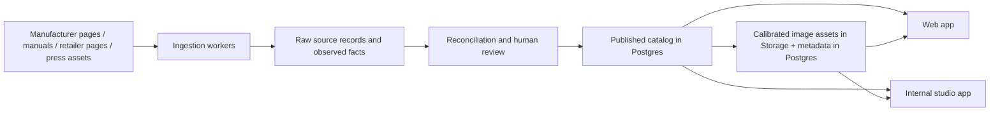

# Architecture

## Goal

Build a modern replacement for Camera Size that:

- compares camera bodies visually at true relative scale
- supports interchangeable lenses, adapters, and optical accessories
- works well on mobile instead of degrading into a desktop-only tool
- keeps the catalog current through automation without losing provenance

## Product Principles

1. Physical plausibility matters more than visual gimmicks.
2. The catalog must model compatibility as a graph, not as free text.
3. Source data and published data must be separated.
4. Images are not decorative assets; they are calibrated measurement assets.
5. Mobile is a first-class interaction model, not a reduced afterthought.

## Recommended Stack

- Monorepo: `pnpm` + `turbo`
- Web app: `Next.js` + `React`
- Database: `Supabase` on top of PostgreSQL
- Storage: Supabase Storage for calibrated PNG/WebP assets and source files
- Jobs: scheduled jobs plus worker processes that write back into Postgres
- Auth: Supabase Auth if user features are added later

## Why Supabase

Supabase is a strong fit if we treat it as PostgreSQL first and product framework second.

Reasons:

- Postgres is the right substrate for a compatibility graph and catalog integrity.
- We can combine normalized relational tables with `jsonb` for source-specific extensions.
- Storage, auth, cron, and edge functions reduce operational drag early on.
- SQL remains the source of truth instead of moving core domain rules into app code too early.

What I would avoid:

- a JSON-only schema
- putting all compatibility logic in the frontend
- relying on external search indices before the core catalog model is stable

## Query and API Strategy

I recommend:

- SQL migrations as the source of truth
- Postgres views and SQL functions for the hard catalog queries
- typed server-side access from the app through Supabase and a light query layer

I do not recommend starting with Prisma for this project.

Reasons:

- recursive adapter and mount traversal belongs naturally in SQL
- custom schemas, views, and database functions will matter early
- we want the database to enforce domain rules instead of rebuilding them in app code

## Monorepo Layout

```text
apps/
  studio/
  web/
packages/
  asset-pipeline/
  catalog/
  catalog-schema/
  ingest/
docs/
supabase/
```

## High-Level System



## Application Surfaces

I recommend two application surfaces:

- `apps/web`: public product for search, comparison, sharing, and mobile UX
- `apps/studio`: internal catalog and review tool

The studio app should cover:

- product creation and editing
- source review and fact reconciliation
- asset qualification and calibration review
- job visibility and retry controls

Background workers are separate services or packages, not user-facing apps.

## Core Domain Model

The domain should be modeled around a few stable concepts:

- `brand`: Leica, Sony, Canon, Sigma
- `system`: Sony Alpha E, Leica L-Mount, Nikon Z
- `mount`: L mount, Sony E mount, Leica M mount
- `product`: the shared product envelope for bodies, lenses, adapters, and accessories
- `camera_body`: body-specific physical properties
- `lens`: lens-specific optical and physical properties
- `adapter`: mechanical or optical mount transformation
- `asset`: calibrated product image plus alignment metadata
- `source_record` and `observed_fact`: provenance and extraction trail

This separation matters because brands, systems, and mounts do not map 1:1.

Examples:

- One mount can be used by multiple brands.
- One system can contain multiple mounts over time.
- A body belongs to a system, but compatibility is governed by its mount graph.

## Compatibility Model

Compatibility should be resolved as a directed graph:

- a body exposes one or more body-side mounts
- a lens exposes one or more lens-side mounts
- an adapter transforms a body-side mount into a different lens-side mount

Example:

- Leica SL3-S body exposes `L`
- adapter exposes `L body side -> M lens side`
- any lens with native `M` mount becomes reachable

This is why adapters should not be modeled as a string field on lenses or bodies.

For user experience, the system should also support a generic conversion choice such as:

- `Leica M -> Leica L adapter`
- `Leica M -> Nikon Z adapter`

That generic choice should resolve to:

- a mount-conversion record for compatibility logic
- a default real adapter product for measurements, weight, and rendering

## Rendering Model

Each renderable asset should be treated as calibrated geometry plus pixels:

- transparent image
- known view angle: front, rear, top, left, right
- visual configuration state when relevant, for example lens with hood vs without hood
- pixels-per-mm scale
- mount-center anchor
- baseline anchor

That allows the app to:

- place two bodies side by side accurately
- attach a lens to the correct mount location
- apply adapter chain length and weight
- choose the correct lens variant when only hood-on or hood-off imagery exists
- swap between front, rear, and top views without inventing fake proportions

## Data Freshness Strategy

Do not write automation directly into the published catalog tables.

Recommended flow:

1. Fetch source pages and assets into raw source records.
2. Extract observed facts with confidence and normalization metadata.
3. Reconcile conflicts into a review queue.
4. Publish reviewed changes into catalog tables.
5. Generate or validate calibrated assets and attach them to products.

This gives us:

- auditability
- safe re-runs
- conflict visibility
- a path to partial automation without corrupting the public catalog

## Asset Strategy

This is the hardest part of the system.

Recommendations:

- Prefer official press assets only when licensing and reuse terms are acceptable.
- Keep the source image, cutout, and calibrated derivative as separate records.
- Make human review part of the calibration flow.
- Do not depend on AI image generation for canonical catalog imagery.

AI can help with segmentation and cleanup, but the catalog should use measured and reviewable assets, not hallucinated renders.

## Suggested Delivery Phases

### Phase 1

- stand up the database schema
- create seed data for brands, mounts, and a few bodies/lenses/adapters
- build the comparison workspace for two bodies and one lens chain

### Phase 2

- add source ingestion
- add asset processing and calibration tooling
- add public search and filter UX

### Phase 3

- add accounts, saved kits, sharing, and community contribution workflows

## Near-Term Recommendation

Start with:

- a flexible relational schema in Supabase
- a hand-seeded golden dataset of 20 to 50 products
- a calibration workflow that proves accurate visual scaling

The app UX is important, but the real moat is the catalog model plus the asset pipeline.
